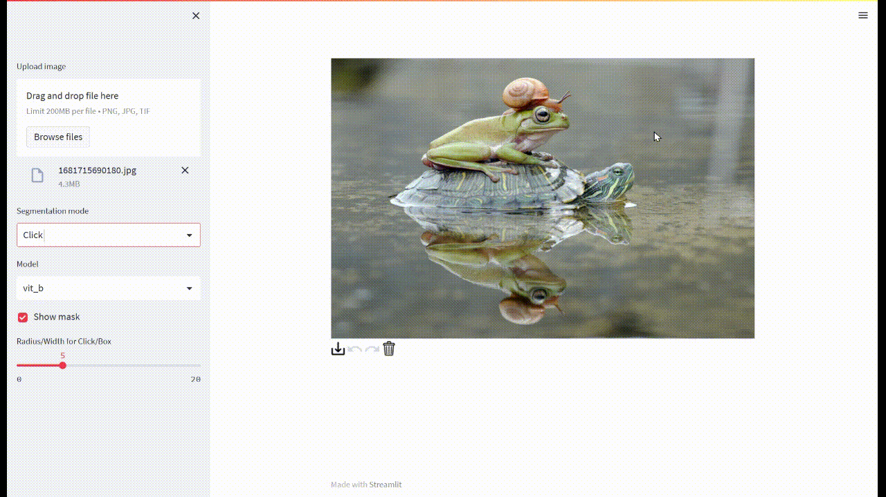

# Segment anything-streamlit webui


This is a streamlit web interface for the [Segment Anything](https://github.com/facebookresearch/segment-anything).

# 1. install Modified streamlit_drawable_canvas
We modified [streamlit-drawable-canvas](https://github.com/andfanilo/streamlit-drawable-canvas) to add Left and Right Click Functions

If you have installed streamlit_drawable_canvas, uninstall it
```shell
pip uninstall streamlit-drawable-canvas
```
Install our version，make sure you have installed npm
```shell
cd streamlit_dc/streamlit_drawable_canvas/frontend
npm install
npm run build
cd streamlit_dc/
pip install -e .
cd ../
```

# 2. install dependencies and get checkpoints
```shell
pip install --no-cache-dir git+https://github.com/facebookresearch/segment-anything.git
pip install -r requirements.txt

mkdir checkpoint
wget https://dl.fbaipublicfiles.com/segment_anything/sam_vit_b_01ec64.pth -O checkpoint/sam_vit_b_01ec64.pth
wget https://dl.fbaipublicfiles.com/segment_anything/sam_vit_l_0b3195.pth -O checkpoint/sam_vit_l_0b3195.pth
wget https://dl.fbaipublicfiles.com/segment_anything/sam_vit_h_4b8939.pth -O checkpoint/sam_vit_h_4b8939.pth
```

# 3. Run
```shell
streamlit run sam_st.py
```

# Docker
```shell
docker build -t sam_st .
docker run --gpus "device=0" -itd -p 84:8501 --name sam_st sam_st:latest bash -c 'streamlit run sam_st.py'
```